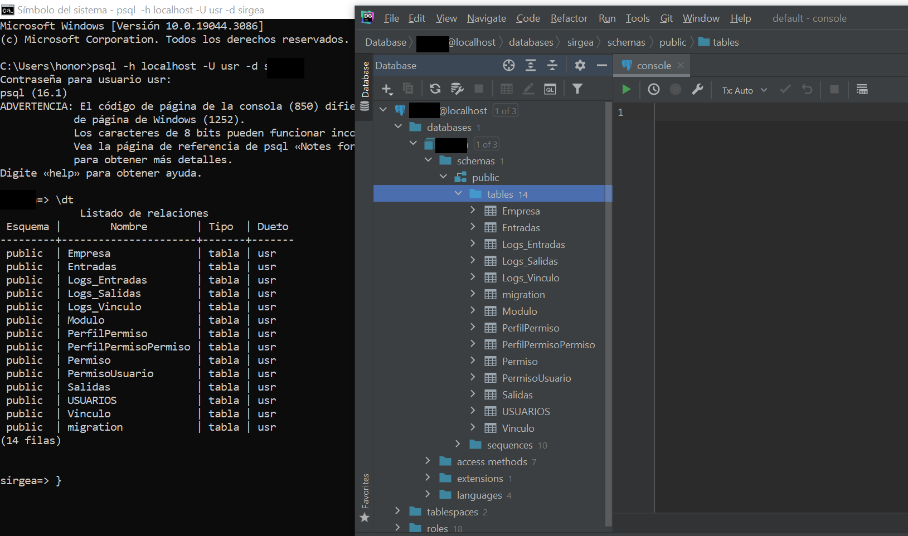
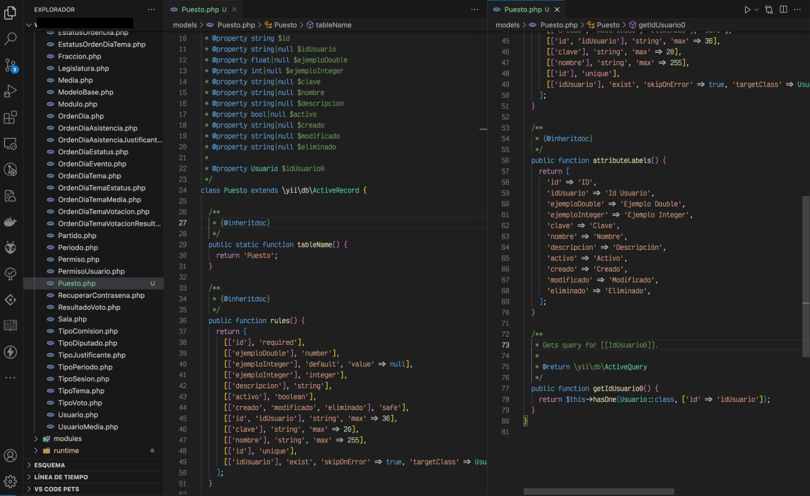

# Guía de Desarrollo en Backend con Yii 2

# Tabla de Contenido

- [Guía de Desarrollo - Creación de Tablas y Consumo de Endpoints en el Backend YII 2](#guía-de-desarrollo---creación-de-tablas-y-consumo-de-endpoints-en-el-backend-yii-2)
  - [Acerca del Proyecto](#acerca-del-proyecto)
  - [El Archivo Principal](#el-archivo-principal)
    - [1. Crear un Rol (Usuario) para la Base de Datos](#1-crear-un-rol-usuario-para-la-base-de-datos)
    - [2. Crear una Base de Datos](#2-crear-una-base-de-datos)
    - [3. Configurar en el Archivo `config/db.php`](#3-configurar-en-el-archivo-configdbphp)
    - [4. Clonar el Proyecto de PHP](#4-clonar-el-proyecto-de-php)
    - [5. Migraciones](#5-migraciones)
    - [6. Creación de Tablas](#6-creación-de-tablas)
    - [7. Inicialización de Servidor PHP](#7-inicialización-de-servidor-php)
    - [8. Generador de Modelos a través del Yii 2](#8-generador-de-modelos-a-través-del-yii-2)
    - [9. Modelos a través del Yii 2](#9-modelos-a-través-del-yii-2)
    - [9. Configuración de Controladores](#9-configuración-de-controladores)
  - [TODO](#todo)
  - [Tecnologías](#tecnologías)

# Guía de Desarrollo - Creación de Tablas y Consumo de Endpoints en el Backend YII 2

## Acerca del Proyecto

Este documento tiene como objetivo proporcionar las pautas y pasos necesarios para llevar a cabo la creación de tablas y servir información mediante el consumo de endpoints o APIs en el backend.

## El Archivo Principal

El archivo principal contiene una serie de pasos detallados que deben seguirse para configurar y poner en marcha el proyecto. A continuación, se describen los principales puntos:

## Prerrequisitos

Setear tus variables de entorno

### 1. Crear un Rol (Usuario) para la Base de Datos

Se explicará cómo crear un rol de usuario específico para la base de datos, garantizando la seguridad y los permisos adecuados.
<br><br>Recuerda tener instalado el motor del posgres para poder operar la consola.


Ingresar el siguiente ejemplo desde la consola de (psql):

```
create role "DB_USER" with login password 'DB_PASSWORD';
```

### 2. Crear una Base de Datos

Los pasos para la creación de la base de datos necesaria serán detallados, asegurando la correcta configuración del entorno de almacenamiento de datos.
Ingresar el siguiente ejemplo desde la consola de (psql):

```
create database "DB_NAME" with owner="DB_USER" template=template0;
```

**nota:** recuerda agregar el mismo nombre de usuario, password, nombre de la base de datos en tu archivo db.php antes de aplicar tus migraciones

### 3. Configurar en el Archivo `config/db.php`

Se proporcionarán instrucciones sobre cómo configurar adecuadamente el archivo `db.php` para establecer la conexión entre la aplicación y la base de datos.
<br>
<br>
Configurar en el archivo config/db.php la información de la base de datos, reemplazar DB_NAME, DB_USER y DB_PWD


### 4. Clonar el Proyecto de PHP

Instrucciones sobre cómo clonar el proyecto desde el repositorio de PHP para obtener la estructura base del proyecto.

```
https://git.miralo.xyz/computo21/yii2.git
```

<br>
Después de clonar el proyecto ejecutar en la terminal instalar las dependencias composer
~~~
composer install
~~~
Si te aparece el siguiente error, proceder a actualizar composer.


```
composer update
```

### 5. Migraciones

Se describirá el proceso de migración, que implica aplicar y gestionar cambios en la base de datos a medida que evoluciona la aplicación.
<br>
Comando para ejecutar migraciones.

```
php yii migrate
```

Comando para ejecutar solo una migración.

```
php yii migrate/up 1
```


<br>
Comando para crear un archivo de migración.

```
php yii migrate/create :name:
```

Si deseas ver las tablas creadas en tu base de datos, lo puedes hacer dentro de psql con el comando.

```
\dt
```


Si deseas checar la conectividad a tu base de datos, puedes hacerlo de la siguiente manera.
Setear las variables de entorno de Postgres.
<br>

<br>
Puedes proceder a gestionar tu base de datos directamente ahora desde CMD.

```
psql -h localhost -U sirgea -d your_database_name
```

Con el siguiente comando sales del modo PSQL.

```
\q
```

También se puede utilizar el gestor Datagrip para facilitar de manera manual las transacciones.


Configuración del Datagrip.


**nota:** como podemos observar, pudimos configurar la conexión desde la interfaz gráfica de usuario (GUI), mediante Datagrip, para facilitar la gestión de la base de datos previamente creada.

### 6. Creación de Tablas.

Pasos detallados sobre la creación de tablas específicas, asegurando la coherencia y estructuración adecuada de los datos.
<br>
Ejemplo para hacer una tabla, llave primaria, llave foránea.


### 7. Inicialización del servidor PHP.

Instrucciones para inicializar el servidor PHP y poner en marcha la aplicación localmente.
<br>


Comando para iniciar un servidor HTTP en el proyecto.

```
php yii serve
```

La primera pantalla al iniciar el servidor es:


**nota: **recuerda agregar la extensión gii para crear tus modelos http://localhost:8080/gii


### 8. Generador de Modelos a través del Yii 2

Cómo utilizar el generador de modelos proporcionado por Yii 2 para facilitar la creación de modelos de datos.
<br>
Entrar en la url del servidor HTTP e ir a la url http://localhost:8080/gii para entrar en el generador de código, después elegir "Model Generator"

<br>
Rellenar los campos "Table Name" y "Model Class Name"

<br>
Dale clic en "Preview" y después "Generate" para generar el modelo de la tabla.

### 9. Modelos a través del Yii 2

Archivo generado en la carpeta "models"

Corregir etiquetas de "attributeLabels", nombre de las relaciones ("getIdUsuario0" => "getUsuario") y php doc (documentación sobre la clase)

Generar en el directorio models del módulo donde estemos trabajando (por lo general en modules/v1/models), agregar una clase que herede del archivo que acabamos de generar y agregaremos los métodos fields (campos visibles por el cliente) y extraFields (relaciones visibles por el cliente).

el modelo que está en la raíz debe heredar de ModeloBase


### 9. Configuración de Controladores.

Instrucciones sobre cómo configurar controladores para gestionar de manera eficiente las solicitudes y respuestas en la aplicación.
<br>
Para crear el controlador, copiar el archivo de un catálogo y renombrar el archivo, la clase y la variable $modelClass, corregir los textos de los mensajes de respuesta.


### TODO

Lista de tareas pendientes o mejoras planificadas para el proyecto.

# Tecnologías

1. [Composer](https://getcomposer.org/): Herramienta de gestión de dependencias para PHP.
2. [PHP](https://www.php.net/): PHP puede ser instalado mediante XAMPP. Se recomienda la versión PHP 7.2.31 a < 8.0.
3. [DataGrip](https://www.jetbrains.com/datagrip/): Entorno de desarrollo para bases de datos.
4. [Git](https://git-scm.com/): Sistema de control de versiones distribuido.
5. [PostgreSQL](https://www.postgresql.org/): Motor de base de datos relacional.
