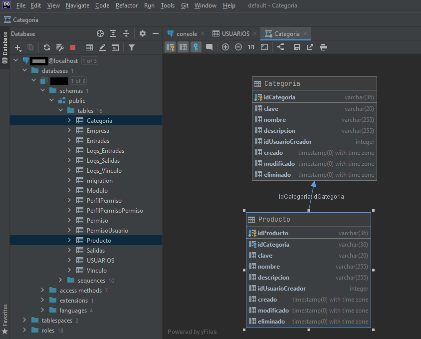
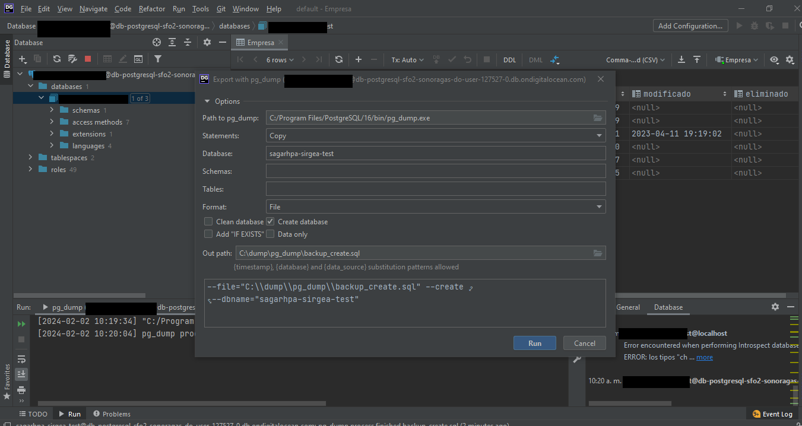
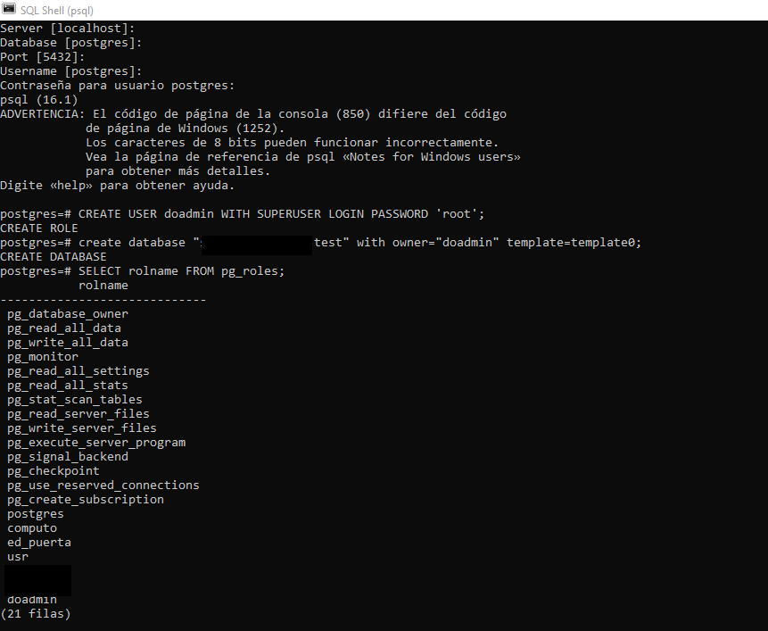
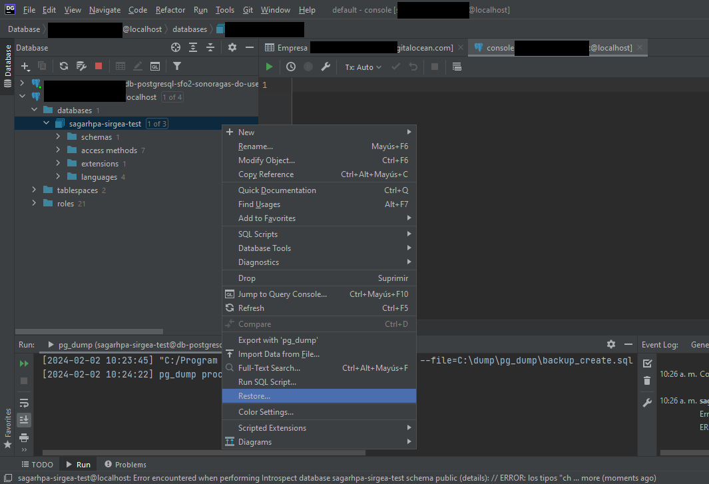

# Guía de Desarrollo - Creación de Tablas y Consumo de Endpoints en el Backend YII 2

## Tabla de Contenido

- [Acerca del Proyecto](#acerca-del-proyecto)
- [El Archivo Principal](#el-archivo-principal)
  - [1. Crear un Rol (Usuario) para la Base de Datos](#1-crear-un-rol-usuario-para-la-base-de-datos)
  - [2. Crear una Base de Datos](#2-crear-una-base-de-datos)
  - [3. Configurar en el Archivo `config/db.php`](#3-configurar-en-el-archivo-configdbphp)
  - [4. Clonar el Proyecto de PHP](#4-clonar-el-proyecto-de-php)
  - [5. Migraciones](#5-migraciones)
  - [6. Creación de Tablas](#6-creación-de-tablas)
  - [7. Inicialización de Servidor PHP](#7-inicialización-de-servidor-php)
  - [8. Generador de Modelos a través del Yii 2](#8-generador-de-modelos-a-través-del-yii-2)
  - [9. Modelos a través del Yii 2](#9-modelos-a-través-del-yii-2)
  - [10. Configuración de Controladores](#10-configuración-de-controladores)
  - [11. Creación BackUp Base de datos en Local](#11-creación_backup_base_de_datos_en_local)
- [TODO](#todo)
- [Tecnologías](#tecnologías)

## Acerca del Proyecto

Este documento tiene como objetivo proporcionar las pautas y pasos necesarios para llevar a cabo la creación de tablas y servir información mediante el consumo de endpoints o APIs en el backend.

## El Archivo Principal

El archivo principal contiene una serie de pasos detallados que deben seguirse para configurar y poner en marcha el proyecto. A continuación, se describen los principales puntos:

## Prerrequisitos

Setear tus variables de entorno.

### 1. Crear un Rol (Usuario) para la Base de Datos

Se explicará cómo crear un rol de usuario específico para la base de datos, garantizando la seguridad y los permisos adecuados.
<br><br>Recuerda tener instalado el motor del posgres para poder operar la consola.


Ingresar el siguiente ejemplo desde la consola de (psql):

```
create role "DB_USER" with login password 'DB_PASSWORD';
```

### 2. Crear una Base de Datos

Los pasos para la creación de la base de datos necesaria serán detallados, asegurando la correcta configuración del entorno de almacenamiento de datos.
Ingresar el siguiente ejemplo desde la consola de (psql):

```
create database "DB_NAME" with owner="DB_USER" template=template0;
```

**Nota:** recuerda agregar el mismo nombre de usuario, password, nombre de la base de datos en tu archivo db.php antes de aplicar tus migraciones.

### 3. Configurar en el archivo 'config/db.php.

Se proporcionarán instrucciones sobre cómo configurar adecuadamente el archivo `db.php` para establecer la conexión entre la aplicación y la base de datos.
<br>
<br>
Configurar en el archivo config/db.php la información de la base de datos, reemplazar DB_NAME, DB_USER y DB_PWD


### 4. Clonar el Proyecto de PHP

Instrucciones sobre cómo clonar el proyecto desde el repositorio de PHP para obtener la estructura base del proyecto.

```
https://git.miralo.xyz/computo21/yii2.git
```

<br>
Después de clonar el proyecto, ejecutar en la terminal, instalar las dependencias composer
~~~
composer install
~~~
Sí te aparece el siguiente error proceder a actualizar composer.


```
composer update
```

### 5. Migraciones

Se describirá el proceso de migración, que implica aplicar y gestionar cambios en la base de datos a medida que evoluciona la aplicación.
<br>
Comando para ejecutar migraciones.

```
php yii migrate
```

Comando para ejecutar solo una migración.

```
php yii migrate/up 1
```


<br>
Comando para crear un archivo de migración.

```
php yii migrate/create :name:
```

Si deseas ver las tablas creadas en tu base de datos, lo puedes hacer dentro de psql con el comando.

```
\dt
```


Si deseas checar la conectividad a tu base de datos, puedes hacerlo de la siguiente manera.
Setear las variables de entorno de Postgres.
<br>

<br>
Puedes proceder a gestionar tu base de datos directamente ahora desde CMD.

```
psql -h localhost -U DB_USER -d your_database_name
```

Con el siguiente comando sales del modo PSQL.

```
\q
```

También se puede utilizar el gestor Datagrip para facilitar de manera manual las transacciones.


Configuración del Datagrip.

**nota:** como podemos observar, pudimos configurar la conexión desde la interfaz gráfica de usuario (GUI), mediante Datagrip, para facilitar la gestión de la base de datos previamente creada.

### 6. Creación de Tablas.

Pasos detallados sobre la creación de tablas específicas, asegurando la coherencia y estructuración adecuada de los datos.
<br>
Ejemplo para hacer una tabla, llave primaria, llave foránea.


```
php yii migrate/create tbl_ra
```


Comando para dar downgrade a la migración.

```
php yii migrate/down
```

Codigo para crear dos entidades Producto Categoria
<br> **archivo:m240201_185131_tbl_test.php**

```php
<?php

use yii\db\Migration;

/**
 * Class m240201_185131_tbl_test
 */
class m240201_185131_tbl_test extends Migration
{
    /**
     * {@inheritdoc}
     */
    public function safeUp()
    {
        $this->createTable('Producto', [
            // "idProducto" => $this->primaryKey(), // Esta es una manera de volver llave primaria
            "idProducto" => $this->string(36),  // UUID es por eso el 36
            "idCategoria" => $this->string(36),
            "clave" => $this->string(20),
            "nombre" => $this->string("255"),
            "descripcion" => $this->string("255"),
            "idUsuarioCreador" => $this->integer(),
            "creado" => $this->timestamp() . " with time zone",
            "modificado" => $this->timestamp() . " with time zone",
            "eliminado" => $this->timestamp() . " with time zone",
          ]);

          $this->addPrimaryKey('ProductoPK', 'Producto', 'idProducto');

          $this->createTable('Categoria', [
            "idCategoria" => $this->string(36),
            "clave" => $this->string(20),
            "nombre" => $this->string("255"),
            "descripcion" => $this->string("255"),
            "idUsuarioCreador" => $this->integer(),
            "creado" => $this->timestamp() . " with time zone",
            "modificado" => $this->timestamp() . " with time zone",
            "eliminado" => $this->timestamp() . " with time zone",
          ]);

          $this->addPrimaryKey('CategoriaPK', 'Categoria', 'idCategoria');

          $this->addForeignKey('ProductoIdCategoriaFK', 'Producto', 'idCategoria', 'Categoria', 'idCategoria');
    }

    /**
     * {@inheritdoc}
     */
    public function safeDown()
    {
        echo "m240201_185131_tbl_test cannot be reverted.\n";
        $this->dropForeignKey('ProductoIdCategoriaFK', 'Producto');
        $this->dropTable("Producto");
        $this->dropTable("Categoria");

    }

    /*
    // Use up()/down() to run migration code without a transaction.
    public function up()
    {

    }

    public function down()
    {
        echo "m240201_185131_tbl_test cannot be reverted.\n";

        return false;
    }
    */
}
```

Al ejecutar la migración, si todo está bien, debe aparecer tus tablas en la base de datos, en este caso producto-categoría.


**nota:** Podemos visualizar la relación entre entidades mediante Datagrip.


### 7. Inicialización del servidor PHP.

Instrucciones para inicializar el servidor PHP y poner en marcha la aplicación localmente.
<br>


Comando para iniciar un servidor HTTP en el proyecto.

```
php yii serve
```

La primera pantalla al iniciar el servidor es:


** Nota: **recuerda agregar la extensión gii para crear tus modelos http://localhost:8080/gii


### 8. Generador de Modelos a través del Yii 2

Cómo utilizar el generador de modelos proporcionado por Yii 2 para facilitar la creación de modelos de datos.
<br>
Entrar en la URL del servidor HTTP e ir a la URL http://localhost:8080/gii para entrar en el generador de código, después elegir "Model Generator".

<br>
Rellenar los campos "Table Name" y "Model Class Name"

<br>
Dale clic en "Preview" y después "Generate" para generar el modelo de la tabla.

Ejemplo de generación de modelos Producto y categoría.


### 9. Modelos a través del Yii 2

Archivo generado en la carpeta "models"; normalizar la nomenclatura de los modificadores de acceso, ya que en veces el modelo en atributeLabels se genera con plurales o “s”, etc.


**Ejemplo**

Corregir etiquetas de "attributeLabels", nombre de las relaciones ("getIdUsuario0" => "getUsuario") y php doc (documentación sobre la clase).

Generar en el directorio models del módulo donde estemos trabajando (por lo general en modules/v1/models).
<br>Agregar una clase que herede del archivo que acabamos de generar.
<br>Agregaremos los métodos fields (campos visibles por el producto como categoría) y extraFields sería categoría.


**Ejemplo:**

el modelo que está en la raíz debe heredar de ModeloBase \*\*Solo para cuando se tenga implementada en código la clase, en su mayoría para cuando se generan los id's del tipo UUID string(32)


### 10. Configuración de controladores.

Instrucciones sobre cómo configurar controladores para gestionar de manera eficiente las solicitudes y respuestas en la aplicación.
<br>
Para crear el controlador, copiar el archivo de un catálogo y renombrar el archivo, la clase y la variable $modelClass, corregir los textos de los mensajes de respuesta.


**Ejemplo:**
Utilizar una plantilla previa del controlador y remplazar el catalogo con el cual se necesita interactuar.


**Ejemplo Código Controlador Producto.**

<br> **Archivo:ProductoController.php**

```php
<?php

namespace v1\controllers;

use common\data\Respuesta;
use common\models\Usuario;
use common\rest\AuthController;
use yii\db\Expression;

class ProductoController extends AuthController {

  public $modelClass = "v1\models\Producto";

  public function actionIndex() {
    $id = intval($this->req->get("id", ""));
    $q = trim($this->req->get("q", ""));

    $query = $this->queryInicial;

    if($this->usuario->TIPO == Usuario::TIPO_USUARIO){
      $query->andWhere(["{{Producto}}.id" => $this->usuario->idProducto]);
    }

    if($id > 0) {
      $query->andWhere(["id" => $id]);
    }

    if($q) {
      # Ejemplo de buscador
      $query->andWhere([
        "OR",
        ["ilike", "nombre", $q],
        ["ilike", "clave", $q],
      ]);
    }

    return new Respuesta($query, $this->limite, $this->pagina, $this->ordenar);
  }

  public function actionGuardar() {
    $id = intval($this->req->getBodyParam("id", null));
    $user = \Yii::$app->getUser()->getId();
    $modelo = null;

    if($id > 0) {
      $modelo = $this->modelClass::findOne($id);
    }
    if($modelo === null) {
      $modelo = new $this->modelClass();
      $modelo->creado = new Expression('now()');
      $modelo->idUsuarioCreador = $user;
    } else {
      $modelo->modificado = new Expression('now()');
    }

    $modelo->load($this->req->getBodyParams(), '');
    if (!$modelo->save()) {
      return (new Respuesta($modelo))
        ->mensaje("Hubo un problema al guardar la Producto");
    }

    $modelo->refresh();
    return (new Respuesta($modelo))
      ->mensaje("Producto guardada");
  }

  public function actionEliminar() {
    $id = intval($this->req->getBodyParam("id", null));
    $modelo = null;

    if($id > 0) {
      $modelo = $this->modelClass::findOne(["id" => $id]);
    }
    if($modelo === null) {
      return (new Respuesta())
        ->esError()
        ->mensaje("Producto no encontrada");
    }
    $modelo->eliminado = new Expression('now()');
    if(!$modelo->save()) {
      return (new Respuesta($modelo))
        ->mensaje("No se pudo eliminar la Producto");
    }

    return (new Respuesta())
      ->mensaje("Producto eliminada");
  }
}
```

### 11. Creación BackUp Base de datos en Local.

Instrucciones sobre cómo configurar el entorno local haciendo un respaldo de la base de datos.
<br>
Exportar la base de datos del servidor, mediante las opciones de pg dump.

Configurar y correr el generador del archivo.

**Comandos Útiles para crear el rol y la base de datos.**

```
create role "SAGARHPA" with login password 'root';

DROP ROLE IF EXISTS doadmin;

DROP DATABASE IF EXISTS "sagarhpa-sirgea-test";

SELECT rolname FROM pg_roles;

CREATE USER doadmin WITH SUPERUSER LOGIN PASSWORD 'root';

\du  => rol actual y permisos asignados

create database "sagarhpa-sirgea-test" with owner="doadmin" template=template0;

```

**Ejemplo**

Conectar instancia servidor local.

Restaurar Backup en el local.

Ejecutar restore de la Base de datos.

**Deberán aparecer las tablas con los datos**


### TODO

Lista de tareas pendientes o mejoras planificadas para el proyecto.
**Evitar datos sensibles, usar alias.**

# Tecnologías

1. [Composer](https://getcomposer.org/): Herramienta de gestión de dependencias para PHP.
2. [PHP](https://www.php.net/): PHP puede ser instalado mediante XAMPP. Se recomienda la versión PHP 7.2.31 a < 8.0.
3. [DataGrip](https://www.jetbrains.com/datagrip/): Entorno de desarrollo para bases de datos.
4. [Git](https://git-scm.com/): Sistema de control de versiones distribuido.
5. [PostgreSQL](https://www.postgresql.org/): Motor de base de datos relacional.
